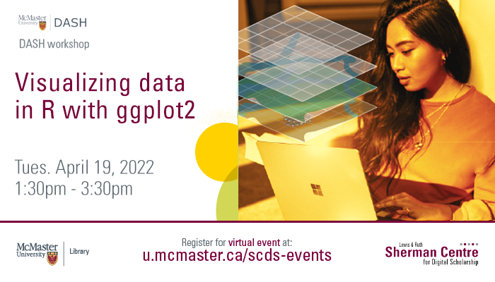

# Welcome to Data Visualization in R with ggplot2

Learn how you can create publication-quality figures using ggplot2. This web module will cover plotting options for one- and two-dimensional continuous and categorical data and explore options for customizing your figure’s appearance. 

Proceed to the [Preparation](preparation) page to get started.

